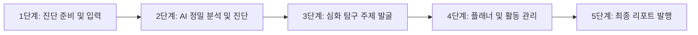

# 수프리마 플랫폼 (Suprima) 서비스 운영 및 코칭 매뉴얼
## 학원 및 그룹 코칭 클래스 운영 표준 가이드

> [!IMPORTANT]
> 이 매뉴얼은 학원 원장, 입시 컨설턴트 및 그룹 코칭 리더가 **수프리마 플랫폼(Suprima)**을 활용해 고품질의 학생부종합전형 관리 클래스를 개설하고, 이탈 없는 프리미엄 코칭 서비스를 운영할 수 있도록 설계된 **실무 표준 운영 지침서**입니다.

---

## 1. 초기 세팅 및 회원 관리 (Initial Configuration)

플랫폼 도입 직후, 고품질 서비스를 제공하기 위해 아래 3단계 초기 세팅을 선행해 주십시오.

```mermaid
flowchain
    step1[1. 마스터 계정 로그인 및 학원 정보 설정]
    step2[2. 동료 컨설턴트 및 스태프 계정 등록]
    step3[3. 학생 등록 및 라이선스 배정]
```

### 1) 환경 설정 및 라이선스 매핑 (`환경 설정`)
* **경로**: 사이드바 하단 ⚙️ `환경 설정` (Settings)
* **주요 작업**:
  * **학원 정보 등록**: 학원 공식 명칭, 연락처 및 리포트에 인쇄될 공식 로고 이미지를 업로드합니다.
  * **프롬프트 튜닝 (옵션)**: 수프리마는 Google Gemini 기반의 최적화된 프롬프트를 내장하고 있으나, 학원의 고유 코칭 컬러에 맞춰 세특 탐구 생성 프롬프트나 진단 톤앤매너를 직접 미세 조정할 수 있습니다.
  * **데이터 대량 업로드**: 기존 관리 중인 학생이 많다면 양식(XLSX)을 다운로드하여 학생의 기본정보와 성적 데이터를 **일괄 업로드(Bulk Upload)**할 수 있습니다.

### 2) 관리자 배정 관리 (`관리자 배정 관리`)
* **경로**: 사이드바 하단 🏢 `관리자 배정 관리` (Admin Dashboard)
* **주요 작업**:
  * **브랜치(지점) 활성화**: 여러 관을 보유한 학원의 경우, 각 지점별로 하위 그룹을 생성해 데이터를 격리 및 독립 운영합니다.
  * **컨설턴트 등록**: 새로 합류한 입시 강사나 컨설턴트의 이메일을 등록하고, 각 지점 또는 특정 학생 그룹을 전담할 수 있도록 권한을 매핑합니다.
  * **라이선스 제어 (`LicenseGuard`)**: 각 학생에게 활성 라이선스를 배정하여 라이선스가 만료된 학생은 무단 조회가 제한되도록 가드합니다.

---

## 2. 수프리마 5단계 표준 코칭 워크플로우

매월 또는 학기별로 진행되는 '세특 심화 탐구 반'의 표준 운영 절차입니다. 본 흐름을 철저히 준수함으로써 상담의 객관성과 가치를 극대화할 수 있습니다.



---

### [1단계] 진단 준비 및 입력 (학생 데이터 적재)
* **목적**: 학생의 성적(정량)과 학교 활동 이력(정성)을 완벽히 데이터화하여 정밀 분석의 기반을 닦습니다.
* **코치 행동 강령**:
  1. 👤 `학생 CRM 관리` 메뉴에서 **[신규 학생 등록]** 버튼을 클릭합니다.
  2. 학생의 기본 프로필, 목표 계열(예: 의학, 소프트웨어, 경제경영 등), 수집할 준비물 리스트를 확인합니다.
  3. 학생이 기존에 작성한 나이스(NEIS) 학생부 텍스트나 활동지 요약본을 복사하여 **학생부/성적분석** 입력창에 붙여 넣습니다.

---

### [2단계] AI 정밀 분석 및 진단 (학생 위치 진단)
* **목적**: 현재 학생부의 정성적 경쟁력과 교과 등급을 교차 분석하여 강약점을 한눈에 보여줍니다.
* **코치 행동 강령**:
  1. 📄 `학생부/성적분석` 메뉴로 진입하여 분석을 수행합니다.
  2. 시스템이 제공하는 **'강점/보완점 3줄 요약'**을 확인하고, 학생의 전공적합성이 누락된 교과목을 발굴합니다.
  3. **평가 시뮬레이션(Evaluation Simulation)** 탭을 활용해 지원 가능한 대학 군의 가이드라인을 설정합니다.
  4. 코치 코멘트 란에 학생이 이번 학기에 반드시 보완해야 할 **'핵심 개선 과제'**를 2~3개 직접 추가 입력합니다.

---

### [3단계] 심화 탐구 주제 발굴 (처방전 발행)
* **목적**: 전공과 연계된 깊이 있는 심화 탐구 주제와 구체적인 세특 초안을 제공해 수행평가 압박을 해결합니다.
* **코치 행동 강령**:
  1. 💡 `주제탐구활동` (AI 탐구 브레인) 메뉴를 실행합니다.
  2. 학생의 특이 관심사와 교과서 대단원/중단원을 설정한 뒤 **[심화 탐구 주제 추천 생성]** 버튼을 누릅니다.
  3. 생성된 3가지 추천 테마 중 가장 학업 역량을 잘 보여줄 수 있는 최우수 주제 1~2개를 선별합니다.
  4. 탐구 동기(Why) - 탐구 활동(What) - 세특 기록 방안(How)으로 구성된 정교한 스토리라인을 함께 검토하며 세특 초안을 조율합니다.

---

### [4단계] 플래너 및 활동 관리 (실행 및 추적)
* **목적**: 계획에 그치지 않고 학생이 실제로 보고서를 마감하여 학교에 제출하도록 기한과 행동을 모니터링합니다.
* **코치 행동 강령**:
  1. 📅 `학습/입시 설계` (Monthly Planner) 메뉴로 이동하여 과목별 수행평가 데드라인을 캘린더에 등록합니다.
  2. `심화탐구가이드` 메뉴를 열어 학생에게 전달할 **보고서 서식 및 구조화 로드맵**을 출력하여 배부합니다.
  3. 주간 코칭 세션마다 플래너의 체크리스트를 확인하며 "미완수"인 항목을 점검하고, 학생이 봉착한 탐구의 병목(예: 참고 문헌 수집 어려움 등)을 상담을 통해 해결해 줍니다.

---

### [5단계] 최종 리포트 발행 및 상담 (성과 입증)
* **목적**: 학기말 또는 매월 말, 코칭의 결과와 학생의 성장 과정을 문서화하여 학부모에게 압도적인 가치를 증명합니다.
* **코치 행동 강령**:
  1. 학생 정보 상세 화면에서 **[월간/진학 리포트 출력]**을 선택합니다.
  2. AI의 분석 결과와 코치가 매주 누적한 피드백 기록, 그리고 최종 완성된 탐구 이력이 완벽히 조화된 리포트인지 미리보기로 검토합니다.
  3. **[PDF 내보내기]** 또는 **[인쇄]** 버튼을 눌러 고품질 리포트를 발행합니다.
  4. 학부모 면담 시 이 리포트를 브리핑하며 다음 학기/시즌 프로그램 재등록(Re-enrollment) 상담을 진행합니다.

---

## 3. 그룹 코칭(Group Coaching) 클래스 특화 운영 팁

1:1 밀착 관리 외에, **1:10 또는 1:15 그룹 코칭**을 운영할 때 수프리마를 200% 활용하는 팁입니다.

> [!TIP]
> **주간 스크럼식 그룹 코칭 기법 (Weekly Scrum Coaching)**
> * **매주 월요일**: 코치는 대시보드 화면을 빔프로젝터에 띄우고, 각 학생들의 플래너 완료 현황(성공률 %)을 띄워 긍정적인 자극(Gamification)을 유도합니다.
> * **수행평가 시즌**: 학생들을 진로/전공 계열별(의생명 / IT공학 / 인문사회 등) 소그룹으로 묶어, 수프리마에서 도출된 공통 심화 탐구 가이드를 바탕으로 피어 피드백(Peer Review)을 하도록 유도합니다. 코치는 순회하며 최종 컨설팅만 제공하므로 밀도를 극대화할 수 있습니다.

---

## 4. 고품격 학부모 상담 스크립트 (Counseling Script)

학부모 상담 시 수프리마 플랫폼 화면 및 출력 리포트를 보여주며 대치동급 전문성을 연출하는 대화 가이드라인입니다.

### 场景: 기말고사 직후, 수행평가 및 학생부 종합전형 대비 상담

* **코치**: *"어머님, 이번 기말고사 치르느라 **[학생이름]**이가 정말 고생 많았습니다. 내신 등급도 중요하지만, 이제부터 명문대 합격을 결정짓는 진짜 싸움은 **'학생부 세특 심화 탐구'**입니다. 저희가 도입한 수프리마 전문 입시 분석 솔루션을 통해 **[학생이름]**이의 현재 상태를 정밀 진단했습니다. 화면을 함께 보시죠."*
* *(수프리마 `학생부/성적분석` 대시보드와 '강점/보완점 3줄 요약'을 보여주며)*
* **코치**: *"기존 학생부를 보시면 수학과 과학 등급은 우수하지만, 아쉽게도 **[목표학과]**와 연계된 깊이 있는 컴퓨터 공학적 관심사나 심화 탐구의 흔적이 잘 보이지 않아 전공적합성 점수가 낮게 시뮬레이션되고 있습니다. 이 부분을 이번 기말 세특에서 무조건 보완해야 합니다."*
* **학부모**: *"아, 그렇군요... 그럼 아이가 구체적으로 어떤 주제로 수행평가나 탐구 보고서를 써야 하나요? 애가 혼자서는 주제 잡기를 너무 어려워해서요."*
* **코치**: *"전혀 걱정하실 필요 없습니다. 저희 수프리마 AI 탐구 브레인은 대치동 입시 빅데이터와 최신 학술 논문 트렌드를 완벽히 학습했습니다. **[학생이름]**이가 좋아하는 인공지능과 생명과학 교과를 융합하여 저희가 뽑아낸 맞춤형 심화 탐구 처방전입니다."*
* *(수프리마 `주제탐구활동` 화면의 구체적인 탐구 스토리라인 및 '세특 기록 방안'을 보여주며)*
* **코치**: *"단순히 'AI의 원리를 공부했다'가 아니라, **'선형대수학의 행렬 연산을 활용하여 심전도 데이터의 이상치를 검출하는 머신러닝 알고리즘 탐구'**라는 고도로 구체적이고 수준 높은 스토리라인을 제시합니다. 아이는 이 '심화탐구가이드'를 보며 저희와 함께 주차별로 작성하기만 하면 됩니다."*
* **학부모**: *"와, 정말 체계적이네요. 일반 학원에서는 그냥 보고서 써오라고만 하고 피드백이 없었는데, 이렇게 단계별로 플래너 관리까지 해주니까 정말 믿음이 갑니다."*
* **코치**: *"네, 매주 진행 단계는 모바일 플래너로 즉시 체크되며, 한 학기 활동이 완수되면 고품격 진학 리포트북으로 최종 발행해 드립니다. 이번 방학 코칭 반에서 **[학생이름]**이를 의대 합격생 수준의 학생부로 업그레이드해 내겠습니다."*

---
*본 실무 매뉴얼을 수프리마 플랫폼 운영 공간에 비치하시고, 모든 신입 코치 교육 및 학부모 상담 프로세스의 표준 규격으로 활용해 주시기 바랍니다.*
